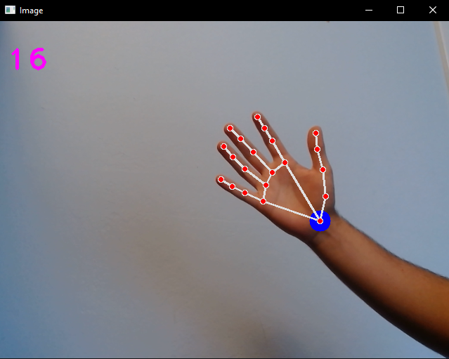

# AdvancedComputerVision

Use Googles pre-trained models to track objects in a video stream.





# Getting started

Windows

```
python -m pip install -r requirements.txt
```

You will also need the `*Module.py` for the file you want to run, for example if you want to run `myHandTracking.py` you will need the `HandTrackingModule.py` in the same folder.

## Troubleshooting

If you get the output

```
INFO: Created TensorFlow Lite XNNPACK delegate for CPU.
INFO: Replacing 117 node(s) with delegate (TfLiteXNNPackDelegate) node, yielding 2 partitions.
INFO: Replacing 64 node(s) with delegate (TfLiteXNNPackDelegate) node, yielding 1 partitions.
```

this means the program worked correctly but you might need to change the webcam id.

Simply change the 0 in the line `cap = cv2.VideoCapture(0)` to a 1. Sadly opencv-python does not have an easy way of finding all the connected video devices so there might be some trial and error if 0 and 1 don't word.
